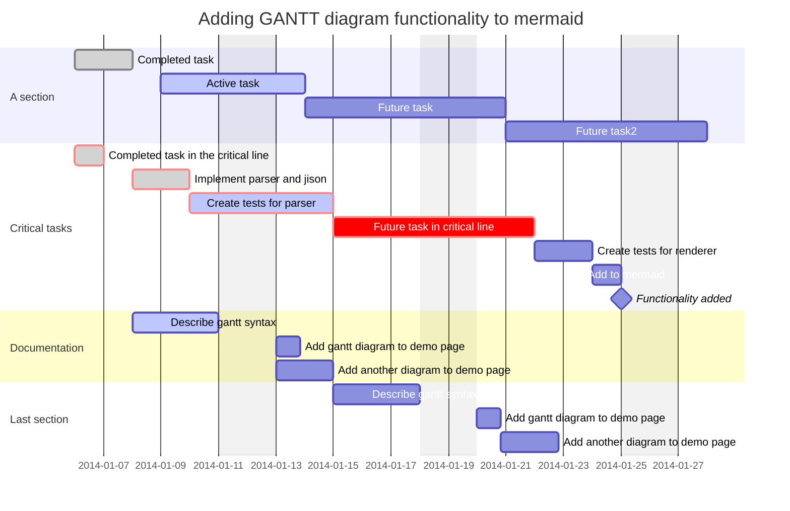

---
{"dg-publish":true,"permalink":"/welcome/","tags":["gardenEntry"],"created":"2026-05-04T13:32:46.426+01:00","dg-note-properties":{}}
---

This is a personal note repository for the HTB-CJCA pathway. 
- All the materials related to Cyber Security are in the *CJCA* folder.
- There are some MISC material with are personal notes not related to Cyber Security.

## Timeline
- The learning started on 20/03/2026`



*If you are a reader and have any suggestions to make this collection of notes better, please send a message using the form below.*
```html
<form name="contact" method="POST" netlify>
  <input type="hidden" name="form-name" value="contact">

  <p> 
    <label>Name 
      <input type="text" name="name" />
    </label> 
  </p> 

  <p>
    <label>Email 
      <input type="email" name="email" />
    </label> 
  </p>

  <p> 
    <button type="submit">Send</button> 
  </p> 
</form>
```
